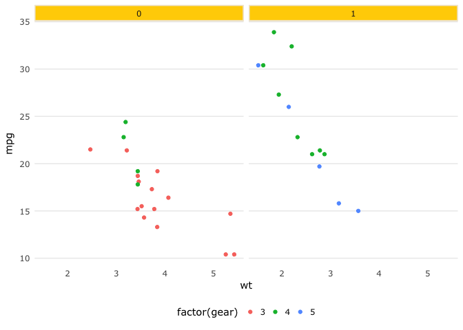

<!-- README.md is generated from README.Rmd. Please edit that file -->
[](https://travis-ci.org/adamhsparks/theme_usq)

theme\_usq
==========

The goal of usq.theme is to provide USQ staff and students with an easy to use *ggplot2* theme that conforms to the USQ visual guidelines for typography and colour.

Example
-------

``` r
library("ggplot2")
library("theme.usq")

p <- ggplot(mtcars) +
  geom_point(aes(
    x = wt,
    y = mpg,
    colour = factor(gear)
  )) +
  facet_wrap( ~ am)

p + theme_usq()
```



Code of Conduct
---------------

Please note that this project is released with a [Contributor Code of Conduct](CONDUCT.md). By participating in this project you agree to abide by its terms.
