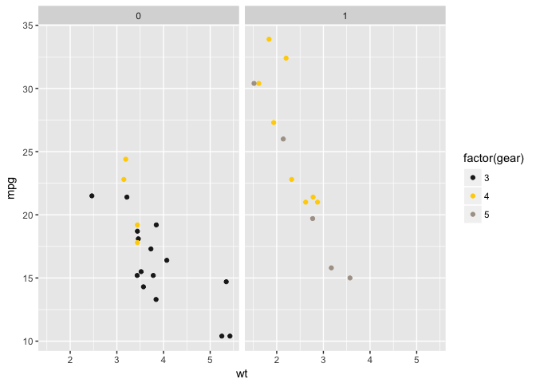
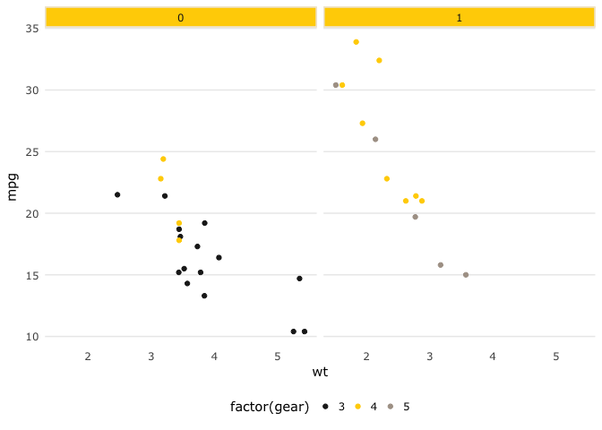
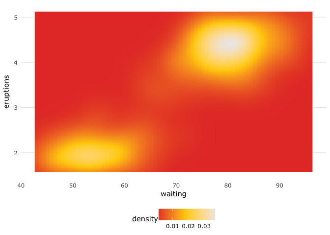
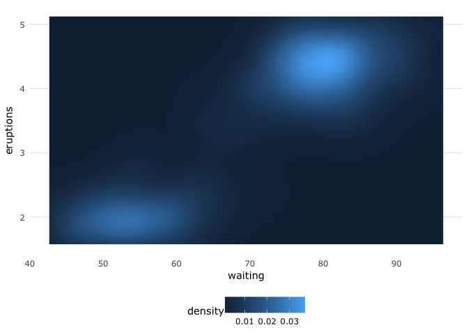

theme\_usq
================

Introduction
============

The goal of *theme.usq* is to provide [University of Southern Queensland](https://usq.edu.au) (USQ) staff and students a quick and easy way to apply USQ colours and typography to graphs created in R using *ggplot2* while providing clear graphs for reports and presentations. All of the colours provided are defined in USQ's Visual Identity Colour Palette, but do not all appear in the same order to maintain usability for the purposes of graphing.

This package has been tested on MacOS, Ubuntu Linux and USQ computers using Windows 7. For Linux users, if you have not installed the MS Core Fonts, you will need to do that for this package to function properly and generate the graphs with the proper typography. Windows and MacOS users should be ready to go with just the installation of this package.

Quickstart
==========

The *theme.usq* package is only available from GitHub. The easiest way to install it is by using the [*devtools*](https://github.com/hadley/devtools) package.

Currently the development version of [*ggplot2*](https://github.com/tidyverse/ggplot2) is required and also needs to be installed from GitHub.

The installation may take some time as some system fonts need to be catalogued to use the Microsoft Verdana font that USQ suggests. Once the installation is done, it should not be necessary to re-catalogue the fonts so loading *theme.usq* will not take any longer than expected.

``` r
if(!require(devtools)){
    install.packages("devtools")
    library(devtools)
}

devtools::install_github("tidyverse/ggplot2")
devtools::install_github("adamhsparks/theme_usq")
```

Examples
========

Example 1: Scatterplots of discrete data
----------------------------------------

Using the *usq.theme's* `theme_usq` for *ggplot2*, plot car weights by mpg and facet by `Transmission` (0 = automatic, 1 = manual) using the `usq_palette` in the `scale_colour_manual` discrete scale function to use USQ colours for the graph.

``` r
library("ggplot2")
library("theme.usq")

# Discrete values
p1 <- ggplot(mtcars) +
  geom_point(aes(
    x = wt,
    y = mpg,
    colour = factor(gear)
  )) +
  scale_colour_manual(values = usq_palette) +
  facet_wrap(~ am)

p1
```


Now add the `theme_usq()` to the graph.

``` r
p1 + theme_usq()
```


Example 2: Heatmaps or other continuous data
--------------------------------------------

Using the *usq.theme's* `theme_usq` for *ggplot2*, plot values using the `usq_fill_gradient` to use USQ colours for continuous values in the graph.

``` r
p2 <- ggplot(faithfuld, aes(waiting, eruptions)) +
  geom_raster(aes(fill = density), interpolate = TRUE) +
  usq_fill_gradient() +
  theme_usq()
  
p2
```



Example 3: Heatmaps using other colour palettes
-----------------------------------------------

`theme_usq()` can be used with any colour palette that you wish to use, while still applying the graph styling and typography to the graph.

Use the default *ggplot2* colour scheme to fill the density plot while using the `theme_usq()` to theme the graph.

``` r
p3 <- ggplot(faithfuld, aes(waiting, eruptions)) +
  geom_raster(aes(fill = density), interpolate = TRUE) +
  theme_usq()
  
p3
```



Example 4: Histograms
---------------------

Use a USQ colour to fill a histogram by using the second value in the `usq_palette` (USQ Charcoal) as the fill value, a good colour for presentations that are going to be projected on a screen.

``` r
p4 <- ggplot(diamonds, aes(carat)) +
  geom_histogram(fill = usq_palette[1]) +
  theme_usq()

p4
#> `stat_bin()` using `bins = 30`. Pick better value with `binwidth`.
```



Example 5: Boxplots
-------------------

Use the USQ colours to fill the boxplots, while using the first value in the `usq_palette` (USQ Charcoal) as the colour value.

``` r
p5 <- ggplot(mpg, aes(class, hwy)) +
  geom_boxplot(aes(fill = drv), colour = usq_palette[1]) +
  scale_fill_manual(values = usq_palette) +
  theme_usq()
  
p5
```


Example 6: Timeseries
---------------------

Plot timeseries lines using discrete colours for each variable of interest.

``` r
p6 <- ggplot(economics_long, aes(date, value01, colour = variable)) +
  geom_line() +
  scale_colour_manual(values = usq_palette) +
  theme_usq()
  
p6
```



Code of Conduct
---------------

Please note that this project is released with a [Contributor Code of Conduct](CONDUCT.md). By participating in this project you agree to abide by its terms.
