theme.usq
================

[](https://travis-ci.org/adamhsparks/theme.usq)
[](https://ci.appveyor.com/project/adamhsparks/theme-usq-8c8gf/branch/master)
[](https://zenodo.org/badge/latestdoi/103536536)

## Introduction to *theme.usq*

The goal of ***`theme.usq`*** is to provide [University of Southern
Queensland](https://usq.edu.au) (USQ) staff and students a quick and
easy way to apply USQ colours and typography to graphs created in R
using the base ***`graphics`*** package or ***`ggplot2`*** while
providing clear graphs for reports and presentations. All of the colours
provided are defined in USQ’s Visual Identity Colour Palette, but do not
all appear in the same order to maintain usability for the purposes of
graphing.

This package has been tested on macOS, Ubuntu Linux and USQ computers
using Windows 7. For Linux users, if you have not installed the MS Core
Fonts, you will need to do that for this package to function properly
and generate the graphs with the proper typography. Windows and macOS
users should be ready to go with just the installation of this package.

## Quickstart

If you do not already have R installed, because ***`theme.usq`*** is an
R package, you will need to install R first. Download and install the
proper version for your computer from
[CRAN](https://cran.r-project.org). It is also suggested to have RStudio
installed as well. You can download the proper installation file from
<https://www.rstudio.com/products/rstudio/download/> for your platform.

Once R and RStudio are set up, you’re ready to install ***`theme.usq`***
through an R session.

The ***`theme.usq`*** package is only available from GitHub. The easiest
way to install it is by using the
[***`devtools`***](https://github.com/hadley/devtools) package.

The installation may take some time as some system fonts need to be
catalogued to use the Microsoft Verdana font that USQ suggests. Once the
installation is complete, it should not be necessary to re-catalogue the
fonts so loading ***`theme.usq`*** will not take any longer than
expected.

To install ***`theme.usq`***, copy/paste the code in the following code
block.

``` r
if(!require(devtools)){
    install.packages("devtools")
    library(devtools)
}

install_github("adamhsparks/theme.usq", dependencies = TRUE)

library("ggplot2")
library("theme.usq")
```

### Keeping *theme.usq* up-to-date

Since ***`theme.usq`*** is still under development with bug fixes and
new features being added and it is not available from CRAN;
`update.packages()` will not update it. To keep ***`theme.usq`***
updated, use:

``` r
devtools::update_packages("theme.usq")
```

## Colours

To view a list of named colours in this package, simply type:

``` r
usq_cols()
#>        usq yellow      usq charcoal  secondary yellow  secondary orange 
#>         "#ffd100"         "#1e1e1e"         "#fdba12"         "#faa61a" 
#>         cool gray    dark warm gray   light_warm gray    support orange 
#>         "#76848f"         "#aca095"         "#efe9e5"         "#f58220" 
#>       support red   support magenta     support green      support blue 
#>         "#e63e30"         "#b63393"         "#63a945"         "#0090ba" 
#>      support navy    support purple support turquiose        light grey 
#>         "#003d77"         "#6a288a"         "#46c1be"         "#f6f6f6" 
#>       medium grey         dark grey 
#>         "#e5e5e5"         "#333333"
```

The resulting list shows the hexadecimal colour, e.g. “\#ffd100”, and
it’s name, “usq yellow”. The names may be used to specify the colours
at any time when plotting.

Following are a few examples of *theme.usq’s* capabilities. Please see
the [package
vignette](https://adamhsparks.github.io/theme.usq/articles/theme.usq.html)
for a more complete listing of capabilities and examples.

## Examples

### Example 1: Scatterplots of discrete data

#### Using `plot_usq()`

Plot plot car weights by miles per gallon.

``` r
plot_usq(x = mtcars$wt, y = mtcars$mpg)
```

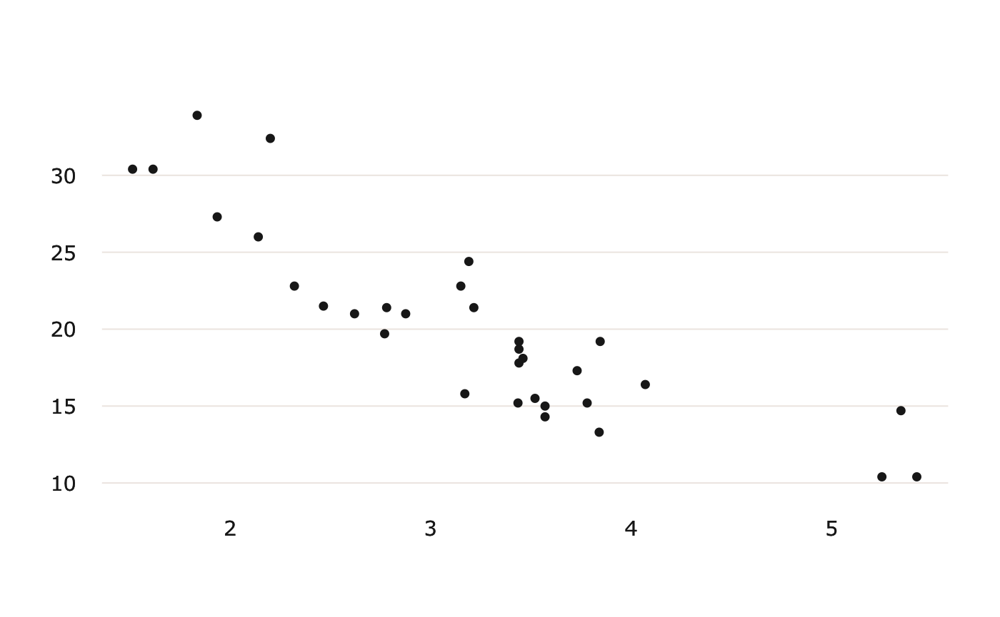<!-- -->

#### Using *ggplot2* and `theme_usq()`

Plot car weights by miles per gallon and facet by `Transmission` (0 =
automatic, 1 = manual) using the `scale_colour_usq` setting `discrete =
TRUE` and using the `cool` palette to use bluish USQ colours for the
graph.

``` r
p1 <- ggplot(mtcars) +
  geom_point(aes(
    x = wt,
    y = mpg,
    colour = factor(gear)
  )) +
  scale_colour_usq(discrete = TRUE,
                   palette = "cool") +
  facet_wrap(~ am)

p1
```

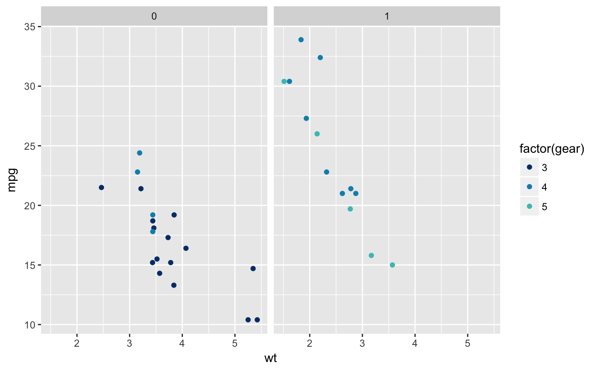<!-- -->

Now add the `theme_usq()` to the graph.

``` r
p1 + theme_usq()
```

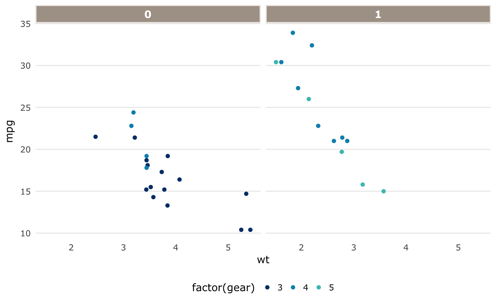<!-- -->

### Example 2: Heatmaps or other continuous data

Using the *theme.usq’s* `theme_usq()` for *ggplot2*, plot values using
the `scale_fill_usq` to use USQ colours for continuous values in the
graph. Two types of gradients are included, `warm_gradient` and
`cool_gradient`.

#### Warm gradients

``` r
p2a <- ggplot(faithfuld, aes(waiting, eruptions)) +
  geom_raster(aes(fill = density),
              interpolate = TRUE) +
  scale_fill_usq("warm",
                 discrete = FALSE) +
  theme_usq()
  
p2a
```

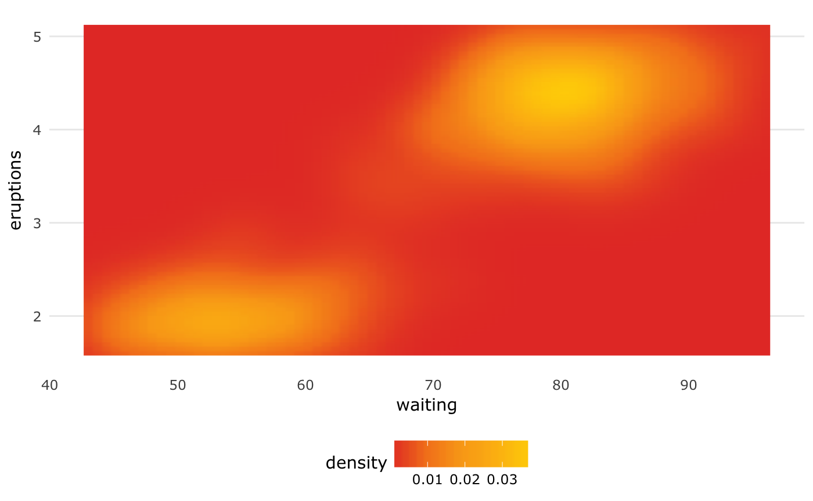<!-- -->

#### Cool gradients

``` r
p2b <- ggplot(faithfuld, aes(waiting, eruptions)) +
  geom_raster(aes(fill = density),
              interpolate = TRUE) +
  scale_fill_usq("cool",
                 discrete = FALSE) +
  theme_usq()
  
p2b
```

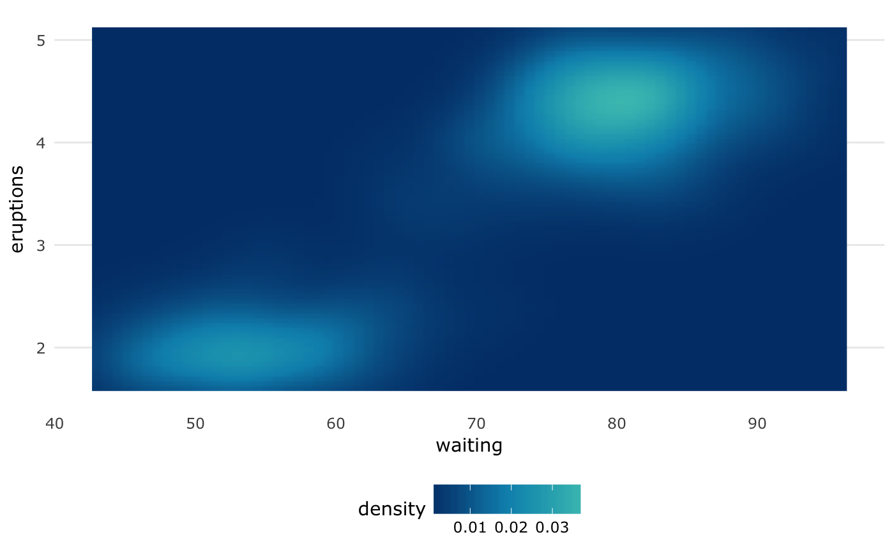<!-- -->

### Example 3: Heatmaps using other colour palettes

#### Using ***ggplot2*** and `theme_usq()`

`theme_usq()` can be used with any colour palette that you wish to use,
while still applying the graph styling and typography to the graph.

Use the default `_**ggplot2**_` colour scheme to fill the density plot
while using the `theme_usq()` to theme the graph.

``` r
p3 <- ggplot(faithfuld, aes(waiting, eruptions)) +
  geom_raster(aes(fill = density), interpolate = TRUE) +
  theme_usq()
  
p3
```

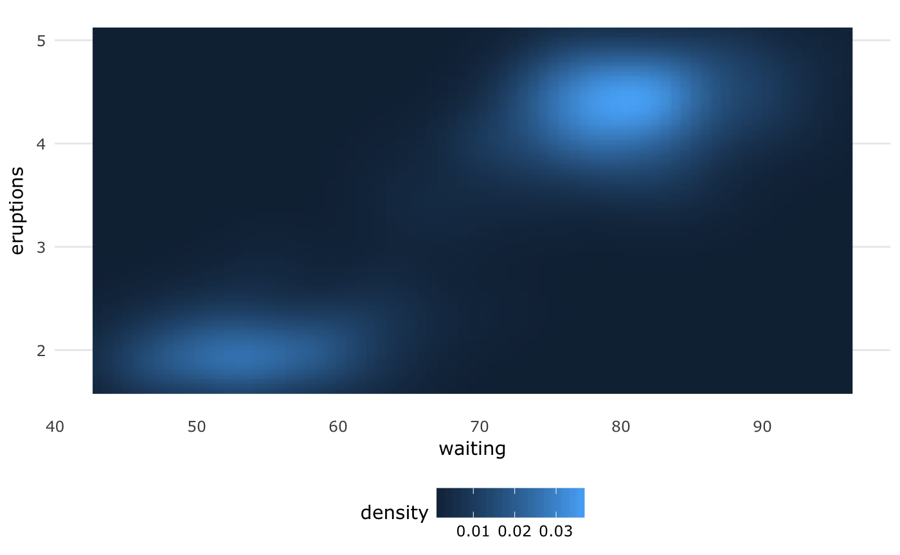<!-- -->

### Example 4: Histograms

#### Using `hist_usq()`

``` r
hist_usq(diamonds$carat)
```

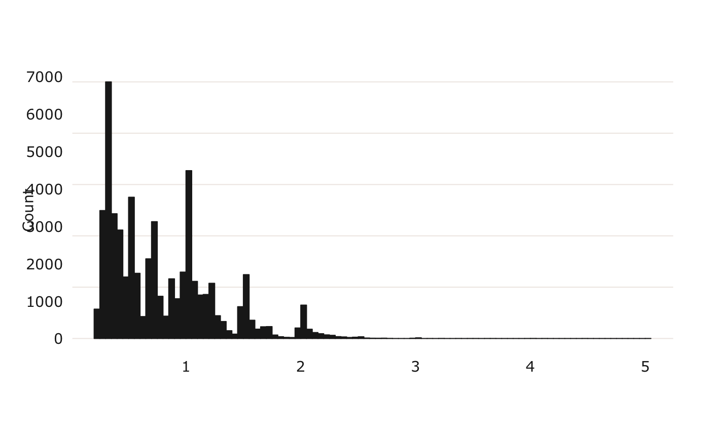<!-- -->

#### Using *ggplot2* and `theme_usq()`

``` r
p4 <- ggplot(diamonds, aes(carat)) +
  geom_histogram(fill = usq_cols("usq charcoal")) +
  theme_usq()

p4
#> `stat_bin()` using `bins = 30`. Pick better value with `binwidth`.
```

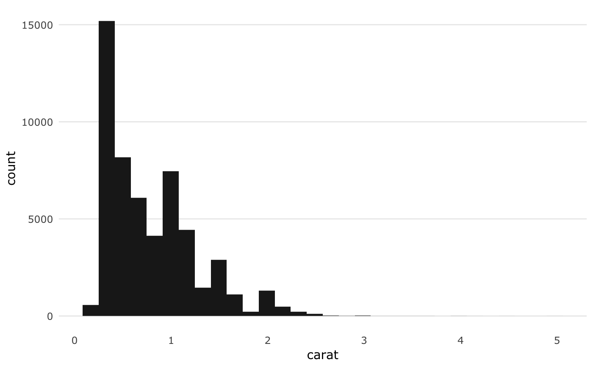<!-- -->

### Example 5: Boxplots

#### Using `boxplot_usq()`

Plot the highway miles per gallon (mpg) of 38 popular car models in the
US by class of car.

``` r
boxplot_usq(mpg$hwy ~ mpg$class)
```

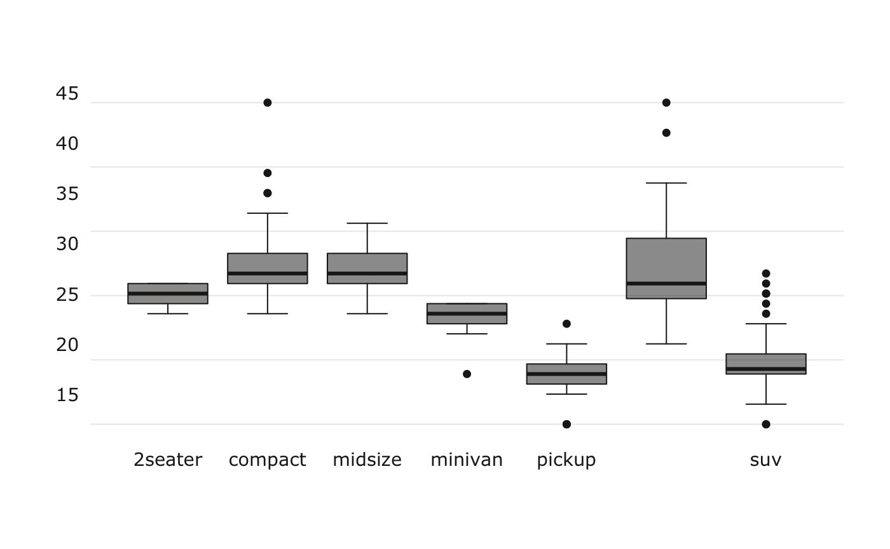<!-- -->

#### Using *ggplot2* and `theme_usq()`

``` r
p5 <- ggplot(mpg, aes(class, hwy)) +
  geom_boxplot(alpha = 0.5,
               fill = usq_cols("usq charcoal"),
               colour = usq_cols("usq charcoal")) +
  theme_usq()
  
p5
```

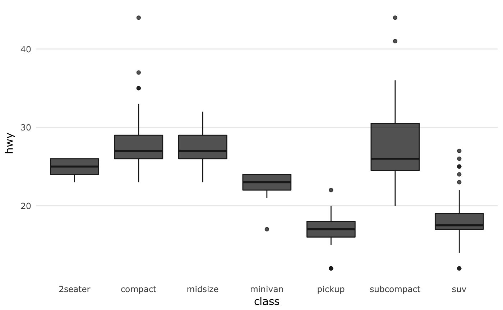<!-- -->

Use the USQ colours to fill the box-plots while using `drv` (*e.g.*,
4-wheel drive, front-wheel drive or rear-wheel drive) for the box-plot
colour.

``` r
p5.1 <- ggplot(mpg, aes(class, hwy)) +
  geom_boxplot(aes(fill = drv),
               colour = usq_cols("usq charcoal")) +
  scale_fill_usq("primary") +
  theme_usq()
  
p5.1
```

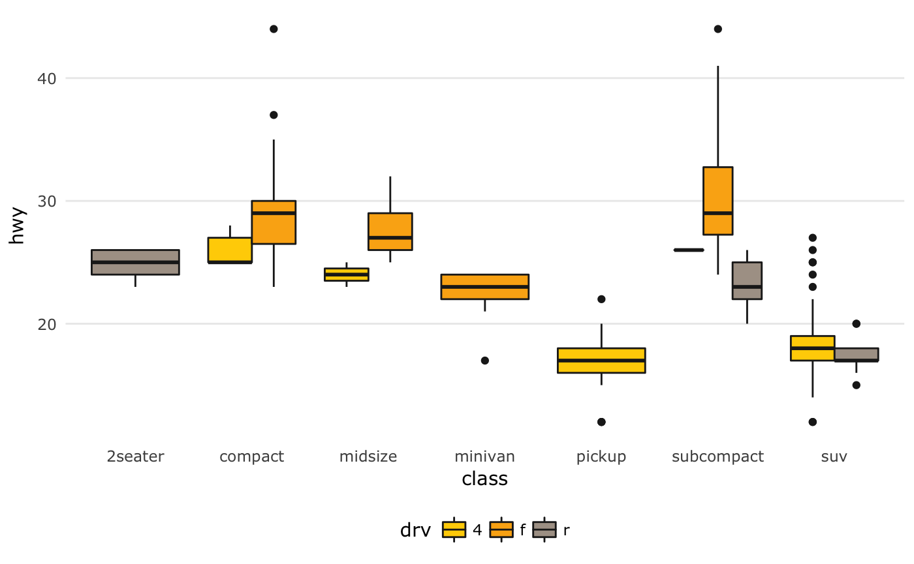<!-- -->

### Example 6: Timeseries

#### Using `_**ggplot2**_` and `theme_usq()` to plot timeseries lines using

discrete colours for each variable of interest. While possible to do
with base R graphics, `_**ggplot2**_` simplifies the process greatly, so
it is the only example provided and suggested for use.

``` r
p6 <- ggplot(economics_long, aes(date, value01, colour = variable)) +
  geom_line() +
  scale_colour_usq("bright") +
  theme_usq()
  
p6
```

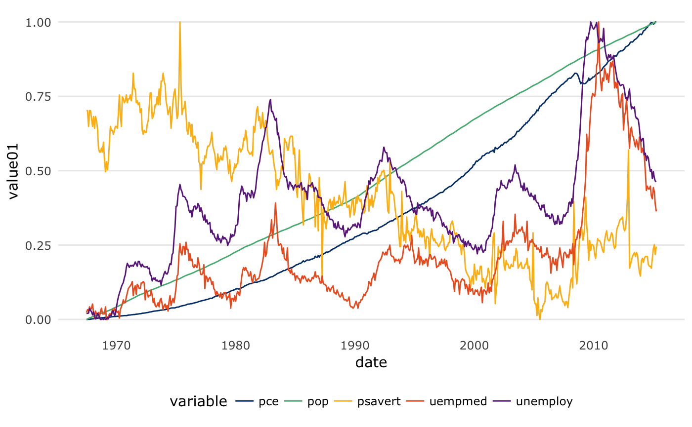<!-- -->

### Example 7: Barplots

#### Using `barplot_usq()`

Plot the areas in thousands of square miles of landmasses which exceed
10,000 sqm.

``` r
barplot_usq(islands, col = "cool gray")
```

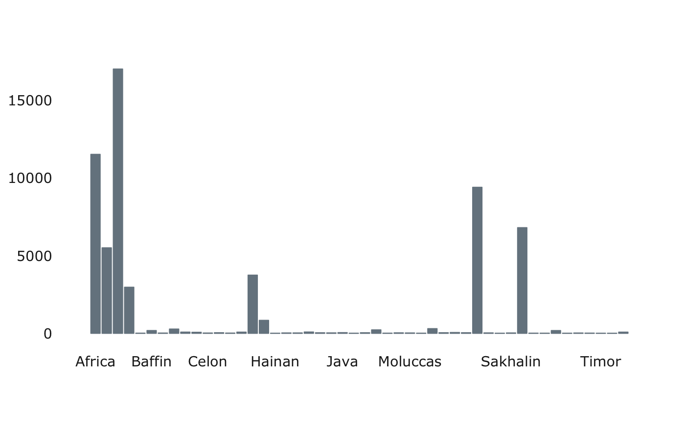<!-- -->

#### Using *ggplot2* and `theme_usq()`

Plot the areas in thousands of square miles of landmasses which exceed
10,000 sqm.

``` r
library(tibble)
islands_df <- as.data.frame(islands)
islands_df <- rownames_to_column(islands_df, "name")

ggplot(islands_df, aes(x = name, y = islands)) +
  geom_bar(stat = "identity", 
           colour = usq_cols("cool gray"),
           fill = usq_cols("cool gray")) +
  theme_usq() +
  theme(axis.text.x = element_text(angle = 45, hjust = 1))
```

<!-- -->

Plot the number of cars from each manufacturer in the `mpg()` dataset.

``` r
ggplot(mpg, aes(manufacturer, fill = manufacturer)) +
  geom_bar() +
  scale_fill_usq(palette = "bright", guide = "none") +
  theme_usq() +
  theme(axis.text.x = element_text(angle = 45, hjust = 1))
```

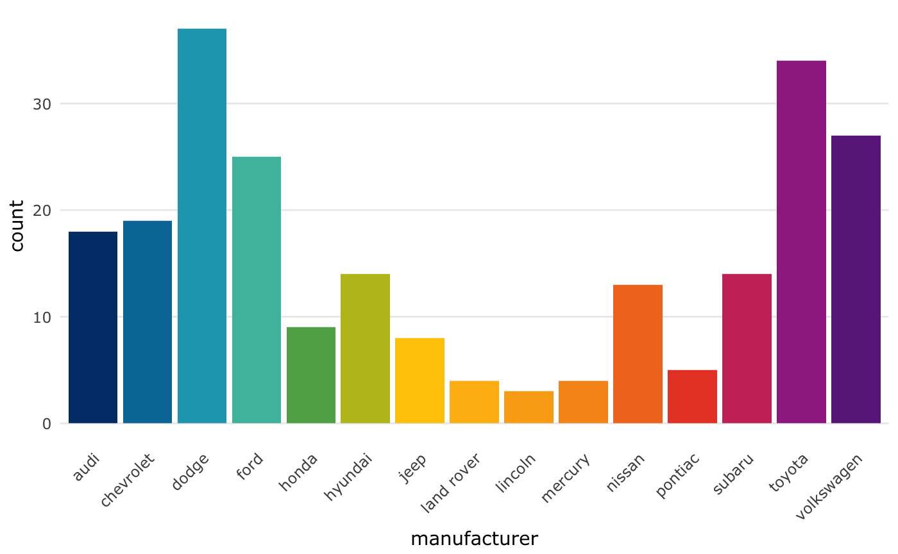<!-- -->

# Using `theme_usq()` in presentations

The default settings for `theme_usq()` are fine for printed materials
such as reports, but if you wish to use it in a presentation you can use
the ***`ggplot2`*** option `base_size =` to increase the size of the
fonts, points and lines in the graphs.

## Example 8: Using *ggplot2*’s `base_size()` with `theme_usq()`

As an example, using `base_size = 24` helps ensure that the graphs are
legible on a standard sized PowerPoint slide when exported at a size of
33.87mm x 19.05mm, using `ggsave()`, for a 16x9 presentation slide that
fills the whole slide.

``` r
p8 <-  ggplot(mpg, aes(class, hwy)) +
  geom_boxplot(fill = usq_cols("usq charcoal"),
               colour = usq_palette("usq charcoal"),
               alpha = 0.5) +
  theme_usq(base_size = 24) +
  theme(axis.text.x = element_text(angle = 45, hjust = 1))

ggsave("slide_p7.png", width = 33.87, height = 19.05, units = "cm",
       dpi = 150)
```

## Meta

  - Please report any [issues or
    bugs](https://github.com/adamhsparks/theme.usq/issues).

  - License: MIT

  - Please note that this project is released with a [Contributor Code
    of Conduct](CONDUCT.md). By participating in this project you agree
    to abide by its terms.
